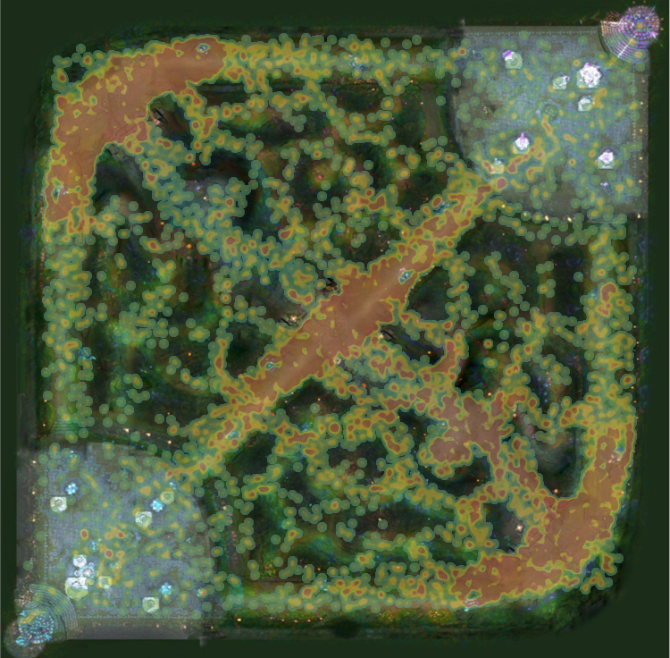

# Personal Project: League of Legends

## Nicolaas Van Steenbergen

### **Objective**: To further skills in: Python, SQL, Tableau, and API calling.

### **Intro**

I have been playing [League of Legends](https://en.wikipedia.org/wiki/League_of_Legends) (LoL), semi-consistently since 2010 and now use it as a way to keep in touch with friends who live across the country. Upon learning about the LoL API, I thought it would be fun to analyze my own games and see if I can come up with any interesting insights.

Needing data to analyze, I specifically played during a special game mode called *URF*. *URF*, or "*Ultra Rapid Fire*" is a fast-paced version of the regular game. This mode quickly provided the 100-game pool I wanted for analysis.

<br/>

### **Understanding the API and Making Calls**

Having experience with Spotify and Google Map’s API, I was already accustomed to using APIs to retrieve data. Riot’s developer portal was a huge help in knowing what data is accessible, because I could make calls and view data in the same browser window. I found which calls would access my match history and added filters to return the “URF” matches.

The first step was to get my Riot-side profile information so I could use their id system when calling my match history. Using my in-game name and region, I obtained all account information necessary for further calls. Shortly after, I was able to grab all match information available and store it as JSON objects.


*[all calls](https://github.com/niconaut/Personal-Project-LoL/blob/master/info_gathering.py)

### **Understanding the data**

Armed with data, I began the long process of, well, processing. Understanding the best way to extract all the data in the JSON files took some time, but was eventually condensed into a handful of short [functions.](https://github.com/niconaut/Personal-Project-LoL/blob/master/custom_functions.py)

<br/>

### **Saving data frames to SQL**

Once the data was in a dataframe format, I connected Python to SQL using psycopg2 and sqlachemy for the data transfer. With the successful storage into SQL, it was time for some exploratory data analysis using queries and Tableau visualizations.

<br/>

### **Finding interesting insights**

First, let us do some rapid-fire insights:

- Winning teams dealt on average ~14% more damage
- Winning teams kill-to-death ratio was **double** the losing teams
- Average game time was 18 minutes, with the longest game of 28 minutes and shortest of just 8 minutes
- 58% of the time, the team with the first kill wins the game
- 67% of the time, the team that destroyed the first tower wins the game. This is a better predictor of winning, due to it happening later in the game
- Winning teams earned more gold per minute which helps them buy items and get stronger more quickly
- Top 5 most winning characters:
    - Morgana – 21 wins
    - Ashe – 17 wins
    - Ezreal – 17 wins
    - Darius – 15 wins
    - Teemo – 14 wins
- 63% of the time, the winning team distributed more “CC”, or “crowd control”, which negatively affects enemy movement. This high win percentage makes sense, since if the enemy is not moving then they are a lot easier to take down.

#### Vision In*sights*

One of the most interesting insights was the impact of ward placement in the game. A *ward* is a totem that can be placed anywhere on the map and reveals enemies that move near it. Wards are a strong mechanic in the game because knowing the location of the opposing team can help you make informed decisions.

While looking at the total wards placed by the winning team vs. the losing team, I was surprised to find no noticeable difference. How could this important mechanic have no effect on the game’s outcome? Investigating further, I dove into *vision score*, which measures the effectiveness of the wards placed. For example, if a ward is placed but does not reveals anything, it gives 0 vision score; where a ward that reveals 5 enemies, gives 5 vision score. Comparing the vision scores of the winning and losing teams, I discovered that 71% of the time, the winning team had a higher score. This shows it’s not the amount of wards placed that wins games, rather the effectiveness of the ward.

```SQL
WITH vs_CTE ("gameId_CTE","visionScore_CTE","teamId_CTE","win_CTE") AS (
	SELECT "gameId",SUM("visionScore"),"teamId","win"
	FROM postparticipantinfo
	GROUP BY "gameId","teamId","win"
	ORDER BY "gameId")

SELECT COUNT(*)
FROM vs_CTE AS one
JOIN vs_CTE AS two ON
one."gameId_CTE" = two."gameId_CTE" AND one."teamId_CTE" != two."teamId_CTE"
WHERE one."visionScore_CTE" > two."visionScore_CTE" AND one."win_CTE" = 'true'
```

#### Heatmap

Where kills happen on the map is a great way to visualize important areas. Using the game map as a background, I plotted all kills from the 100 games to get a heatmap. As seen in the heatmap, the top, middle, and bottom are where most of the action happens. The area between the middle and bottom is also very important. This is due to a special objective in this area, that when captured, gives the capturing team a large, permanent strength increase. Most of the games revolved around this objective and its importance is reflected in the map.



#### 10 minute Deltas

With games lasting roughly 18 minutes, looking at the difference between the two teams at 10 minutes helps us understand important contributing factors to winning.


From the graphic above we can see that the “Team Experience difference” is the most impactful variable. This is because the more experience you have, the faster you level up in game. More experience unlocks stronger skills to use against the opposing team. This advantage eventually adds upon itself, creating a bigger and bigger lead.

The “MS difference”, or “Minion Score”, is also a good indicator on who will win the match. Minions are creatures that give gold and experience to the team who slays them. The “MS” and “Team Experience” differences are intrinsically correlated, since the only ways to gain experience is by slaying minions or other players. Since 36 minions spawn each minute, they are the premier way to gain experience.

The final and least impactful indicator is the “Damage Taken” differential. While the losing team takes more damage on average, the winning team's damage taken varies, making it harder to say if damage taken is a good indicator of future victory.

#### Damage Taken vs. Damage Dealt

Lastly, I wanted to look at my own playing abilities and see how I performed each game. I chose to look into  "Damage I dealt (blue)" vs "Damage I took (red)", and my results were…less than satisfactory. As seen in the graphic below I almost always took more damage than I dealt. Luckily, that appears to have little effect on if I won the game. This reinforces the idea that using damage as a predictor of the outcome is inconsistent. A possible explanation to this outcome, is I tend to play characters that are meant to protect my teammates, so my goal is to take the damage directed at them. Therefore, despite my poor ratio, we can still win the game.


<br/>

### Conclusion

This question of “how’s my playing?” turned into a fun personal project that sharpened my data analysis skills and enhanced my knowledge about the game. I will be making more additions to this project, but this time on a more granular level. Being able to pull game data from top players in the region will allow me to analyze their games and condense thousands of hours of game time into actionable insights.

<br/>
<br/>
<br/>
<br/>
<br/>

#### SQL queries for the curious

most winning champion

```SQL  
SELECT COUNT("win"), "championId"
FROM postparticipantinfo
GROUP BY "championId"
ORDER BY COUNT("win") DESC
```

kill-death ratio

```SQL  
SELECT ROUND(SUM("kills")/SUM("deaths"),2), "win"
FROM postparticipantinfo
GROUP BY "win"
```

kill-death-assist ratio

```SQL  
SELECT ROUND((SUM("kills")+SUM("assists"))/SUM("deaths"),2), "win"
FROM postparticipantinfo
GROUP BY "win"
```

average damage per team in a game

```SQL  
SELECT ROUND(AVG("totalDamageDealtToChampions"),0), "win"
FROM postparticipantinfo
GROUP BY "win"
```

average game time (minutes)

```SQL  
SELECT ROUND(AVG("gameDuration")/60,0)
FROM matchinformation
```

max game time (minutes)

```SQL  
SELECT ROUND(MAX("gameDuration")/60,0)
FROM matchinformation
```

min game time (minutes)

```SQL  
SELECT ROUND(MIN("gameDuration")/60,0)
FROM matchinformation
```

average gold per minute

```SQL  
SELECT ROUND(AVG(postparticipantinfo."goldEarned"/matchinformation."gameDuration")*60,0), postparticipantinfo."win"
FROM postparticipantinfo
JOIN matchinformation
ON postparticipantinfo."gameId" = matchinformation."gameId"
GROUP BY postparticipantinfo."win"
```

average damage per minute

```SQL  
SELECT ROUND(AVG(postparticipantinfo."totalDamageDealtToChampions"/matchinformation."gameDuration")*60,0), postparticipantinfo."win"
FROM postparticipantinfo
JOIN matchinformation
ON postparticipantinfo."gameId" = matchinformation."gameId"
GROUP BY postparticipantinfo."win"
```

how many times did the team with more vision win

```SQL  
WITH vs_CTE ("gameId_CTE","visionScore_CTE","teamId_CTE","win_CTE") AS (
	SELECT "gameId",SUM("visionScore"),"teamId","win"
	FROM postparticipantinfo
	GROUP BY "gameId","teamId","win"
	ORDER BY "gameId")

SELECT COUNT(*)
FROM vs_CTE AS one
JOIN vs_CTE AS two ON
one."gameId_CTE" = two."gameId_CTE" AND one."teamId_CTE" != two."teamId_CTE"
WHERE one."visionScore_CTE" > two."visionScore_CTE" AND one."win_CTE" = 'true'
```

how many times did the team with more wards win

```SQL  
WITH wp_CTE ("gameId_CTE","wardsPlaced_CTE","teamId_CTE","win_CTE") AS (
	SELECT "gameId",SUM("wardsPlaced"),"teamId","win"
	FROM postparticipantinfo
	GROUP BY "gameId","teamId","win"
	ORDER BY "gameId")

SELECT COUNT(*)
FROM wp_CTE AS one
JOIN wp_CTE AS two ON
one."gameId_CTE" = two."gameId_CTE" AND one."teamId_CTE" != two."teamId_CTE"
WHERE one."wardsPlaced_CTE" > two."wardsPlaced_CTE" AND one."win_CTE" = 'true'
```

how many times did the team with more CC win

```SQL  
WITH cc_CTE ("gameId_CTE","timeCCingOthers_CTE","teamId_CTE","win_CTE") AS (
	SELECT "gameId",SUM("timeCCingOthers"),"teamId","win"
	FROM postparticipantinfo
	GROUP BY "gameId","teamId","win"
	ORDER BY "gameId")

SELECT COUNT(*)
FROM cc_CTE AS one
JOIN cc_CTE AS two ON
one."gameId_CTE" = two."gameId_CTE" AND one."teamId_CTE" != two."teamId_CTE"
WHERE one."timeCCingOthers_CTE" > two."timeCCingOthers_CTE" AND one."win_CTE" = 'true'
```

first kill lead to win

```SQL  
SELECT COUNT("firstBloodKill")
FROM postparticipantinfo
WHERE "firstBloodKill" = 'true' AND "win" = 'true'
```

first tower lead to win

```SQL  
SELECT COUNT("firstTower")
FROM teaminformation
WHERE "firstTower" = 'true' AND "win" = 'Win'
```

heatmap setup

```SQL  
SELECT "gameId","timestamp","x_position","y_position","assistingParticipantId1","assistingParticipantId2","assistingParticipantId3","assistingParticipantId4"
FROM matchevents
WHERE "type" = 'CHAMPION_KILL'
```
